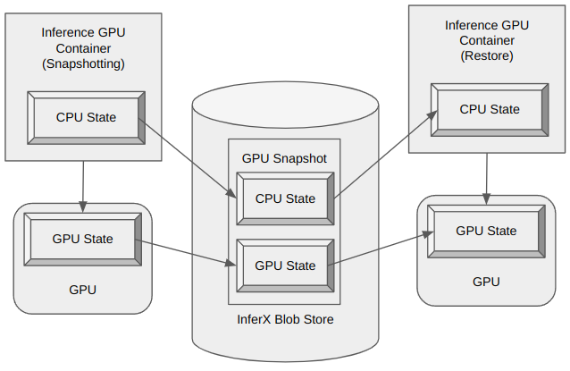
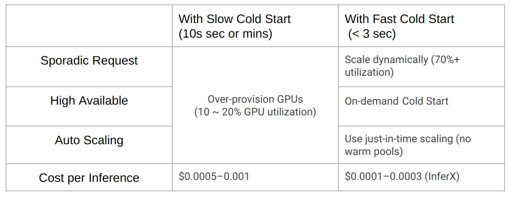
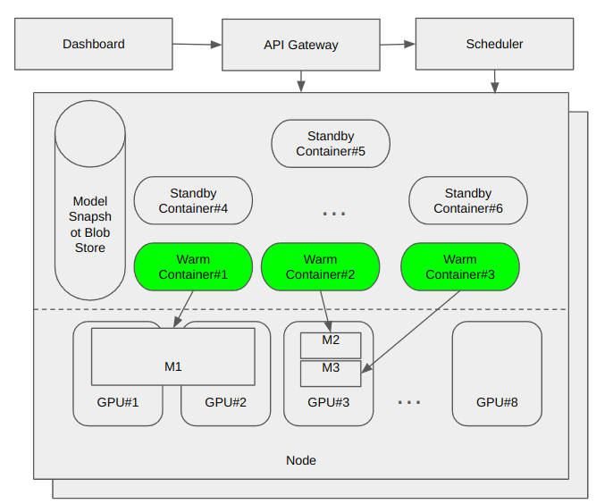

## InferX: AI Lambda-Like Inference Function as a Service with 2-Second Cold Starts & 90% GPU Utilization
InferX is an advanced serverless inference platform engineered for ultra-fast, efficient, and scalable deployment of AI models. It enables serving multiple models within a single environment, achieving cold start times of less than two seconds. Please explore its capabilities further at https://inferx.net.

https://github.com/inferx-net/inferx/wiki/InferX-platform-0.1.0-deployment is the deployment document.

With InferX, you can:

✅ **Ultra Fast cold start** – Cold start GPU-based inference in under 2 seconds for large models (12B+).

✅ **GPU Slicing** – Allocate only a fraction of a GPU (e.g., 1/3 GPU) per model to efficiently run multiple workloads in parallel.

✅ **Super High model deployment density** – Serve hundreds of models on a single node (e.g. 30 models and 2 GPUs in the demo), maximizing hardware utilization.

✅ **80+% GPU utilization** – Based on Just-In-Time scaling and super high deployment density, we can achieve 80% GPU utlization.

✅ **Lambda-like AI Serving** – Automatically scale AI inference workloads with on-demand execution.

✅ **Optimized Performance** – Reduce latency, improve cost efficiency, and streamline AI inference at scale.

Whether you're running LLMs, vision models, or custom AI pipelines, InferX delivers unmatched speed and efficiency for next-gen AI applications.

## The model serve process

1️⃣ **Upload & Deploy** – Users upload their inference docker image, and InferX provides a unique URL.

2️⃣ **Submit Requests** – Users send inference requests using the provided URL.

3️⃣ **Intelligent Scaling** – If a warm instance is available, the request is processed immediately.

4️⃣ **Lightning-Fast Cold Start** – If no warm instance exists, InferX cold-starts a GPU instance in under 4 seconds (&lt; 2 seconds for 24 GB model in the demo), ensuring minimal latency.

## InferX Snapshot based ultra-fast cold start 

InferX ultra-fast cold start is based one **InferX Snapshot**. **InferX Snapshot** is a **Special Container Image** which contains a snapshot for both CPU state and GPU state. The serving process is as below.

1️⃣ **InferX Snapshot generation** – When customer upload the inference container image, InferX platform will do snapshotting normal cold start; after the container image is fully initialized, the platform will snapshot the container instance CPU and GPU state and store that in a file.

2️⃣ **InferX Snapshot pre-warm** – Before the model inference request arrive, InferX platform will load the GPU snapshot in CPU memory or **InferX Blobstore** with ultra-high throughput (PCIe bandwidth, i.e. tens or hundred GB/s per node) . In this phase, the model will take **ZERO GPU resource**.

3️⃣ **Ultra-fast cold start** – When the model inference request arrive InferX platform Gateway, InferX platform will load Snapshot GPU state to GPU memory from CPU memory or InferX Blobstore. In the process, there is no GPU initialization as normal start, the start latency is limited by the GPU PCIe bandwidth. 

## High GPU utlization

The industry Kubernates inference platform's GPU utilization is low (10% ~ 20%), the reasons are as below.

✅  **Sporadic request**: The Inference system will serve sporadic inference request. when there is no request, the GPU based inference instance will be idle.

✅  **High availability**: To satisfy high availility requirement, Production inference platform needs to deploy 1 ~ 4 idle inference instances (~ 2 idle instances for 5 min cold start latency) for Failover and Redundancy.

✅  **Auto scaling**: For busy inference system, because the inference workload is not consistent and inference instance cold start latency is high, the inference platform will also has to deploy idle instances for fast scale out.

Because InferX platform supports ultra-fast cold start and high deloyment density (3000% in the demo), it could increase the GPU utilization to 90%. For the Sporadic request, InferX co-deployment multiple models (might be from multiple tenant) in shared cluster, as the pike time of models normally won't overlap, it could decrease idle time. For high availability and fast scale out, InferX can deploy less or not deploy idle instance.

## Architecture

InferX AI Function Platform is a AI-native serverless inference platform. It servers AI LLM model as AWS Lamda function. 

InferX Platform includes 4 major components:

1. **Dashboard**: This is the GUI interface expose to user;

2. **API Gateway**: This is the API interface. It supports OpenAI Rest API;

3. **Scheduler**: This is cluster level scheduler. When inference request sent to API Gateway, Scheduler will assign a warm instance to server the request if exists, otherwise Scheduler will cold start a new instance;

4. **Blobstore**: This is high throughput blob storage to store Model Snapshot. When restore a Inference Container, the container's snapshot data is transfer from store to GPU and CPU memory.
